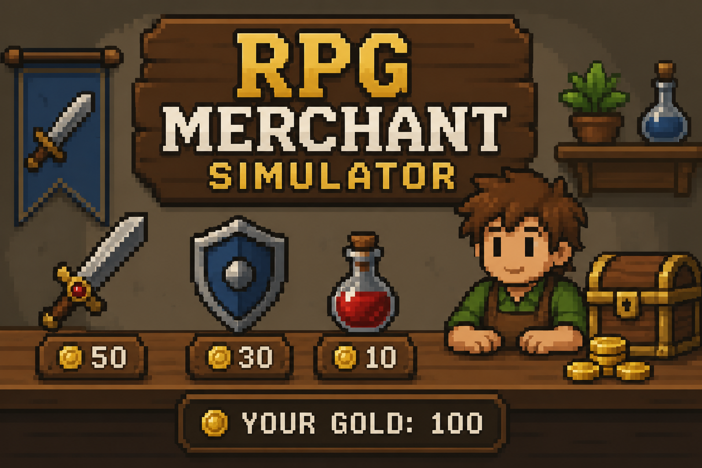

# RPG Merchant Simulator

A small RPG shop simulator built with Python and tkinter for the Code in Place final project.

Buy and sell equipment, manage your inventory, and improve your character stats. Each run generates items with different prices and rarities — a different experience every time.



## Features

- **Shop system** — Browse 6 randomly selected items from a pool of 9
- **Inventory management** — View and sell your owned items
- **Gold economy** — Earn and spend gold as you trade
- **Item rarities** — Common, Rare, Epic, and Legendary tiers
- **Character progression** — ATK and DEF stats improve as you gear up
- **Graphical interface** — Dark-themed UI with color-coded stats and rarity borders

## How to run

```bash
python rpg_shop.py
```

Requires Python 3 with tkinter (included by default on Windows, macOS, and most Linux distributions). No external dependencies.

## Controls

| Action | Input |
|--------|-------|
| Buy an item | Left-click a shop card |
| Sell an item | Right-click an inventory card |

## Credits

Built with ❤️ for the Code in Place 2025 final project.
